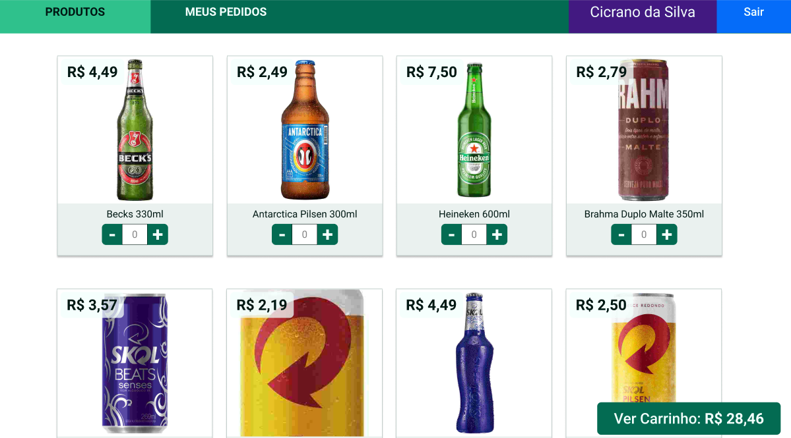

# Boas vindas ao App de Delivery!

A aplicação consiste em desenvolver tanto o back-end quanto o front-end para uma distribuidora de bebidas. Os usuários, incluindo clientes, vendedores e administradores, terão acesso ao aplicativo por meio de login, com funcionalidades distintas para cada um deles. Os clientes poderão fazer pedidos a partir de uma lista de produtos, enquanto os vendedores terão a responsabilidade de aprovar, preparar e entregar os pedidos. O administrador será responsável por gerenciar o acesso ao aplicativo.

A comunicação entre os clientes e os vendedores é essencial para o funcionamento do sistema. Os clientes farão pedidos através do "carrinho de compras", que serão aprovados, preparados e enviados pelos vendedores. 

Ao fazer um pedido, o cliente espera que ele seja exibido no painel de pedidos do vendedor após a atualização da página. Por sua vez, o cliente poderá atualizar sua página para obter informações sobre o status de seu pedido, como se ele estiver sendo preparado ou já estiver em entrega.

Os principais fluxos podem ser divididos em quatro grupos: fluxo comum (login e registro), fluxo do cliente (produtos, checkout, pedidos e detalhes do pedido), fluxo da pessoa vendedora (pedidos e controle do pedido) e validação do status do pedido (teste sem atualização em tempo real e teste com atualização em tempo real). Além disso,  o fluxo da pessoa administradora, que envolve o gerenciamento de usuários.

## Idealizadores

## Funcionalidades

- Registro e login para clientes, vendedores e administradores.
- Navegação e visualização dos produtos.
- Adição de produtos ao carrinho de compras.
- Checkout e conclusão da compra.
- Aprovação, preparo e entrega de pedidos pelos vendedores.
- Rastreamento do status dos pedidos pelos clientes.
- Gerenciamento de usuários pelos administradores.
- Atualizações em tempo real sobre o status dos pedidos.

##  Tecnologias utilizadas
  
### **Front-End**

  <strong> Tecnologias </strong>

 
  
- React
- Styled-components
- React-router-dom
- React-icons
- Stylelint
- Eslint

### **Back-End**

  <strong> Tecnologias </strong>

 

- Javascript
- Node.js
- Express.js
- MySql
- Sequelize
- Arquitetura Model-Service-Controller (MSC)
- JWT
- md5
- Joi
- Joi-password
- Eslint

## Agradecimentos
Agradecemos à Trybe por nos proporcionar esta oportunidade de aprendizado e desenvolvimento de habilidades. Também agradecemos aos instrutores, colegas e mentores que nos apoiaram e orientaram durante o projeto.

[Arthur Costa](https://arthutepio-portifolio.vercel.app/) 😊
  

  

